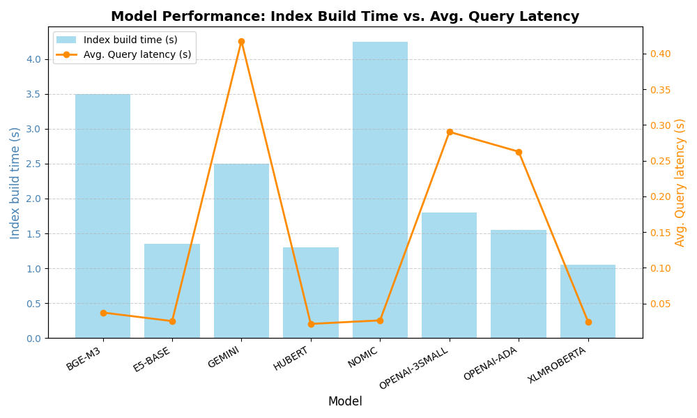
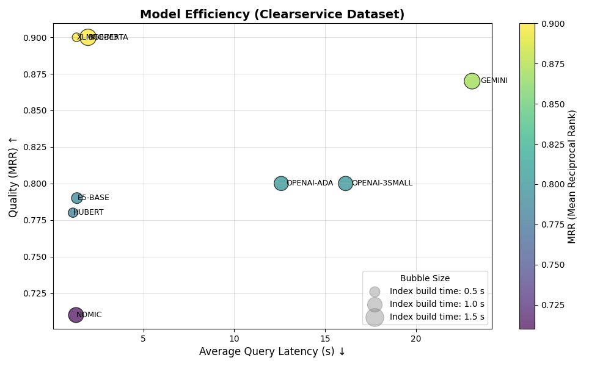

# Comparison of Embedder Models for Hungarian
## RAG for Hungarian documents. Which embedder to use?


## Installation

### Prerequisites

1. Python 3.11.2
2. Git
3. OpenAI API key
4. Gemini API key

### Steps
1. Clone the repository
    ```bash
    git clone https://github.com/margitantal68/hungarian-embeddings
    ```

1. Navigate to the project directory
    ```bash
    cd hungarian-embeddings-hurte
    ```

1. Create and activate a virtual environment
    * On Linux/macOS:
        ```bash
        python3 -m venv .venv
        source .venv/bin/activate
        ```

    * On Windows:
        ```bash
        python -m venv .venv
        .venv\Scripts\activate
        ```

1. Install dependencies
    ```bash
    pip install -r requirements.txt
    ```


## Usage

This project requires an OpenAI API key and Gemini API key. 

1. Obtain your OpenAI API key from [OpenAI's website](https://platform.openai.com/docs/overview).
1. Obtain yor GEMINI API key from [Google AI Studio](https://aistudio.google.com/app/apikey)
1. Copy the **.env.example** file in the project directory:
    ```bash
    cp .env.example .env
    ```

1. Set the API key in the **.env** file:
    ```bash
    OPENAI_API_KEY=your_api_key_here
    GOOGLE_API_KEY=your_api_key_here
    ```

1. Run the project:
    ```bash
    python main.py
    ```

## RAG for Hungarian documents

# Evaluation of Embedding Models for Hungarian Question-Answer Retrieval

## 1. Problem

Hungarian is a morphologically complex, agglutinative language that remains underrepresented in NLP research. High-quality embedding models for Hungarian are scarce and insufficiently evaluated, with few empirical measurements available to assess their performance. This makes it difficult for developers of Hungarian Q&A systems to determine which models are best suited for their applications, particularly in critical domains like Retrieval-Augmented Generation (RAG) systems.

## 2. Solution

This study presents the first comprehensive evaluation of state-of-the-art embedding models for Hungarian question-answer retrieval using:

- **Two complementary datasets**: domain-specific (Clearservice) and general-purpose (HuRTE benchmark)
- **ChromaDB** as the vector database for efficient similarity search
- **Systematic comparison** of 8 embedding models plus BM25 baseline
- **Comprehensive error analysis** identifying failure patterns related to Hungarian morphology, domain-specific terminology, and semantic ambiguity

## 3. Embedder Models

| Model | Usage | Dimension | Sequence Length | Domain | Size |
|-------|-------|-----------|-----------------|--------|------|
| **BGE-M3** | SentenceTransformer - local | 1024 | 8192 tokens | Multilingual | ~560M |
| **E5-BASE** | SentenceTransformer - local | 768 | 512 tokens | Multilingual | ~278M |
| **GEMINI** | Google API | 768 | 2048 tokens | General | Undisclosed |
| **HUBERT** | SentenceTransformer - local | 768 | 512 tokens | Hungarian | ~110M |
| **NOMIC** | Ollama - local | 768 | 2048 tokens | General | ~137M |
| **OPENAI-3SMALL** | OpenAI API | 1536 | 8192 tokens | General | Undisclosed |
| **OPENAI-ADA** | OpenAI API | 1536 | 8192 tokens | General | Undisclosed |
| **XLMROBERTA** | SentenceTransformer - local | 768 | 128 tokens | Multilingual | ~270M |

## 4. Datasets

### Clearservice Dataset
- Custom domain-specific dataset from company documentation
- 50 questions with corresponding topics
- Each question linked to specific topic with reference answer
- Focus: real-world Q&A retrieval scenarios

### HuRTE Dataset
- Hungarian adaptation of Recognizing Textual Entailment (RTE) from GLUE benchmark
- 4,504 examples with premise-hypothesis pairs
- Binary classification (entailment vs. non-entailment)
- **Two evaluation types**:
  - *HuRTE-Positive*: Only positive examples in index and evaluation
  - *HuRTE-All*: All examples in index, positive examples in evaluation

## 5. Metrics

- **Mean Reciprocal Rank (MRR)**: Measures rank position of first relevant document, averaged across all queries
- **Recall@1**: Proportion of queries where correct context appears in top-1 result
- **Recall@3**: Proportion of queries where correct context appears in top-3 results
- **Efficiency metrics**: Index build time and average query latency

## 6. Main Results

### Clearservice Dataset

| Embedder | MRR | Recall@1 | Recall@3 |
|----------|-----|----------|----------|
| **BGE-M3** | **0.90** | **0.86** | **0.96** |
| **XLMROBERTA** | **0.90** | **0.86** | **0.96** |
| GEMINI | 0.87 | 0.78 | 0.98 |
| OPENAI-3SMALL | 0.80 | 0.70 | 0.94 |
| OPENAI-ADA | 0.80 | 0.72 | 0.90 |
| E5-BASE | 0.79 | 0.70 | 0.92 |
| HUBERT | 0.78 | 0.74 | 0.84 |
| NOMIC | 0.71 | 0.64 | 0.80 |
| BM25 (baseline) | 0.77 | 0.68 | 0.80 |

### HuRTE Dataset (HuRTE-Positive Evaluation)

| Model | MRR (Val) | MRR (Train) | Recall@1 (Val) | Recall@1 (Train) | Recall@3 (Val) | Recall@3 (Train) |
|-------|-----------|-------------|----------------|------------------|----------------|------------------|
| **GEMINI** | **0.99** | **0.91** | **0.97** | **0.85** | **1.00** | **0.98** |
| **BGE-M3** | **0.98** | **0.89** | **0.96** | **0.82** | **1.00** | **0.97** |
| OPENAI-3SMALL | 0.94 | 0.85 | 0.92 | 0.78 | 0.97 | 0.92 |
| OPENAI-ADA | 0.94 | 0.84 | 0.91 | 0.78 | 0.98 | 0.92 |
| XLMROBERTA | 0.94 | 0.82 | 0.91 | 0.75 | 0.98 | 0.91 |
| E5-BASE | 0.93 | 0.84 | 0.90 | 0.77 | 0.97 | 0.92 |
| NOMIC | 0.90 | 0.72 | 0.85 | 0.65 | 0.95 | 0.80 |
| HUBERT | 0.82 | 0.63 | 0.77 | 0.53 | 0.88 | 0.74 |
| BM25 | 0.82 | 0.72 | 0.78 | 0.64 | 0.84 | 0.79 |

### Time Efficiency Analysis
#### Index Build Time vs. Query Latency (HuRTE dataset)

 

- **HUBERT** and **XLMROBERTA** offered the best balance of low index build time and fast query latency
- API-based models (GEMINI, OpenAI) exhibited higher query latency due to network overhead

#### Model Efficiency Trade-off (Clearservice dataset)
 


### Key Findings

- **BGE-M3** and **XLMROBERTA** achieved top performance on domain-specific Clearservice data (MRR: 0.90)
- **GEMINI** demonstrated superior performance on HuRTE benchmark (MRR: 0.99)
- **HUBERT** and **XLMROBERTA** offered best efficiency balance with low latency and quick index builds
- Neural embeddings consistently outperformed BM25 baseline, especially on Recall@3
- API-based models (GEMINI, OpenAI) showed higher query latency due to communication overhead
- Error analysis revealed three main failure modes: synonyms/paraphrases, overlapping topics, and domain-specific terminology

---
## References

- [Massive Text Embeddings Leaderboard](https://huggingface.co/blog/mteb)

- [Harang Peter: Mennyire tudnak magyarul az embedding-ek?, 2025.01.09.](https://medium.com/@harangpeter/mennyire-tudnak-magyarul-az-embedding-ek-8207f2bf5cdc)